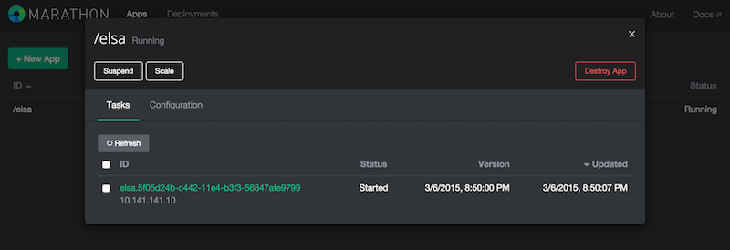

# Elastic Sentiment Analysis

|                  | ElSA                                                       |
| ---------------- | --------------------------------------------------------- |
|  | The Elastic Sentiment Analysis (ElSA) is a simple Spark Streaming-based application that leverages the Mesos stack (esp. Marathon) to derive a public opinion on topics on Twitter. It is able to elastically scale its processing capacity, based on the volume of the traffic concerning said topics. |

ElSA achieves its goal in the following way:

* It takes a list of words (called topics in the following), such as *Mesos*, *Docker*, *DCOS*, etc., as input and, using the Twitter firehose, pulls tweets containing these topics for processing.
* Based on the tweet content it performs a simple sentiment per topic in an ongoing fashion. This ongoing operation is implemented via [Spark Streaming](https://spark.apache.org/docs/latest/streaming-programming-guide.html).
* Last but not least, based on the activity in a certain topic the app scales elastically through leveraging the [Marathon REST API](https://mesosphere.github.io/marathon/docs/rest-api.html). This means that if, for example, a rapid increase of mentions of the topic *DCOS* is detected (tweets per time unit), then more instances are launched.

## Dependencies

* Deploy instructions are for Ubuntu 14.04 (and only tested there for now)
* Apache [Mesos 0.21.x](http://archive.apache.org/dist/mesos/0.21.0/) with [Marathon 0.7.6](https://github.com/mesosphere/marathon/releases/tag/v0.7.6)
* [marathon-python](https://github.com/thefactory/marathon-python)
* Apache [Spark 1.2.x](https://spark.apache.org/downloads.html)
* A Twitter account and an [app](https://apps.twitter.com/) that can be used for accessing the Twitter firehose

## Deployment

In the following, an Ubuntu 14.04 environment is assumed.

### Prerequisites 

For Python packages we need `pip` so before anything else do:

     $ sudo apt-get install python-pip

### Single node

**Install Mesos**: simply use [Playa Mesos](https://github.com/mesosphere/playa-mesos) which contains an Marathon installation or follow the [step-by-step instructions](http://mesos.apache.org/gettingstarted/) from the Apache Mesos site and install Marathon on top of it.

Further, as a preparation for the ElSA app, we need a [Python package](https://github.com/thefactory/marathon-python) wrapping the Marathon [REST API](https://mesosphere.github.io/marathon/docs/rest-api.html) so let's do that right away:

    $ pip install marathon

**Install Spark**:

First we download the Spark source and make sure Java env is set up correctly:

    $ cd
    $ wget http://d3kbcqa49mib13.cloudfront.net/spark-1.2.0.tgz
    $ tar xzf spark-1.2.0.tgz && cd spark-1.2.0/
    $ sudo apt-get install default-jdk
    $ export JAVA_HOME=$(readlink -f /usr/bin/javac | sed "s:bin/javac::")

Now make sure the correct version of Maven (3.0.4 or higher) is available:

    $ sudo apt-get update
    $ sudo apt-get install maven
    $ mvn -version
    Apache Maven 3.0.5
    Maven home: /usr/share/maven
    Java version: 1.7.0_65, vendor: Oracle Corporation
    Java home: /usr/lib/jvm/java-7-openjdk-amd64/jre

OK, ready to build Spark. Note: right now is a good time to get a cup of tea or coffee, whatever floats your boat. As usual, Maven is downloading half of the Internet for the following and that might take, um, a while:

    $ export MAVEN_OPTS="-Xmx2g -XX:MaxPermSize=512M -XX:ReservedCodeCacheSize=512m"
    $ mvn -DskipTests clean package

So, here we are. Next we package our newly built Spark distribution for the Mesos slaves to use:

    $ ./make-distribution.sh
    $ mv dist spark-1.2.0
    $ tar czf spark-1.2.0.tgz spark-1.2.0/
    $ cd conf/
    $ cp spark-env.sh.template spark-env.sh

Now open `../spark-1.2.0/conf/spark-env.sh` in your favorite editor and add the following at the end of the file:

    export MESOS_NATIVE_LIBRARY=/usr/local/lib/libmesos.so
    export SPARK_EXECUTOR_URI=file:///home/vagrant/spark-1.2.0/spark-1.2.0.tgz
    export MASTER=mesos://127.0.1.1:5050

Note that if you've built Spark in a different directory (I did it in `/home/vagrant/`) then you'll have to change the setting for the `SPARK_EXECUTOR_URI` to point to the resulting `tgz` file from the previous step,  

Then, finally, we're ready to launch Spark:

    $ cd ..
    $ bin/spark-shell

**Install Elsa**:

    $ cd
    $ git clone https://github.com/mhausenblas/elsa.git
    $ cd elsa
    $ mvn clean package

### Google Compute

TBD.

### AWS EC2

TBD.

## Usage

Assuming you've installed Mesos, Marathon and Spark as described above, you should now be in the position to launch ElSA as described below.

Note: in order for ElSA to run you'll need to supply your Twitter credentials, that is, you `cp elsa.conf.example elsa.conf` and replace the `YOUR STUFF HERE` sections with the details you obtain from creating a Twitter application and generating the access token via the [app](https://apps.twitter.com/) interface.

### Launching ElSA manually

To launch ElSA manually, do the following:

    $ cd elsa
    $ ./launch-elsa.sh
    Using Spark's default log4j profile: org/apache/spark/log4j-defaults.properties
    15/03/06 19:02:32 INFO ElsaHelper: Setting log level to [ERROR].
    
    In the past 5 seconds I found 0 tweet(s) containing your topics:
    Datacenter DCOS Docker Mesos Mesosphere devop microservice
    
    In the past 5 seconds I found 1 tweet(s) containing your topics:
    Datacenter DCOS Docker Mesos Mesosphere devop microservice
    ===
    RT @SoftLayer: Let’s talk software, specifically how to create a private @Docker registry on SoftLayer. ≡ http://t.co/UVpX1Anl4s http://t.c…
    ===
    
    In the past 5 seconds I found 1 tweet(s) containing your topics:
    Datacenter DCOS Docker Mesos Mesosphere devop microservice
    ===
    RT @DockerParis: .@frazelledazzell on how she runs all her desktop apps in containers and with -rm! #docker #dockermeetup http://t.co/aBYx0…
    ===    

## Launching Elsa through Marathon

To launch ElSA through Marathon and let is scale up and down as traffic on the specified topics is detected, do the following:

    $ cd elsa
    $ ./autoscale.py http://localhost:8080

You should then see something like the following in [Marathon](http://10.141.141.10:8080/):

## To do

- [x] Core business logic 
- [x] Single node deployment and launch
- [ ] Single node elastic
- [ ] Cluster deployment (GCE and EC2)
- [ ] Improve SA incl. visualization (d3)
- [ ] Video walkthrough

## Notes

Kudos to the Spark team for providing [the basis](https://github.com/apache/spark/blob/master/examples/src/main/scala/org/apache/spark/examples/streaming/TwitterPopularTags.scala) for the SA part and to Alexandre Rodrigues for helping me out concerning the initial development.

If you want to learn how to run Spark on Mesos, I suggest you try out the great [step-by-step tutorial](https://mesosphere.com/docs/tutorials/run-spark-on-mesos/) provided by the Mesosphere folks.

Lastly, apologies to all [Frozen](http://www.imdb.com/title/tt2294629/) fans, especially our kids, for hijacking the Elsa label in this context. I thought it's funny … 
